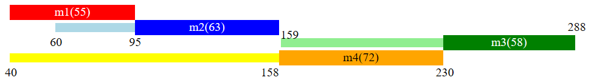

# can-timeline-display
Graphical-only utility for displaying how messages are sent over a CAN bus

[**Available online here**](https://amecn.github.io/can-timeline-display/index.html)

Again, this is only graphical, it just displays what it's told to without logic.

This automatically generates HTML and associated style to achieve such output:



The above is generated by the default following script:

```js
timeScale(3)
timeOrigin(40)

m(1, 40, 40, 55);
m(2, 60, 40+55, 63);
m(3, 40+55+63+1, 40+55+63+72, 58);
m(4, 40, 40+55+63, 72);

moveTimeY(60, -40);
moveTimeY(95, -40);
moveTimeX(158, -15);
moveTimeX(159, 8);
moveTimeY(159, -50);
moveTimeY(288, -60);

color(4, 'yellow', 'orange', 'black');
```

Scripts are written in JavaScript and work with JavaScript's eval()

## Usage
[Go to the page](https://amecn.github.io/can-timeline-display/index.html) and start modifying the script (it's JavaScript).

It updates live (as you type) unless there's any error. Errors are written in red under the script. If messages tell you to go to the browser console or provide inaccurate information, consider using Firefox.

Time labels are added wherever something happens, for example when a message begins to be sent.

When a script successfully runs, it is saved in local storage and can be restored by clicking the button on top "Restore Last Success Run".

## Available functions

#### Add a message
`m(messageId, timeReady, timeSent, length);`
| parameter | details |
| --------- | --------|
| messageId | Message ID (intended >= 1) |
| timeReady | At which time is the message ready to be sent |
| timeSent  | At which time is the message sent |
| length    | How long is the message |

Checks performed:
`timeReady <= timeSent`,
`length > 0`

#### Offset a time label
`moveTimeX(time, x);` and `moveTimeY(time, y);`
| parameter | details |
| --------- | ------- |
| time      | Time to move |
| x         | How many pixels to move the label right (can be negative) |
| y         | How many pixels to move the label down (can be negative) |

Labels are automatically created where a message is ready, starts to be sent, or finishes to be sent.

By default, labels are centered on the corresponding time position, which means close labels can overlap.
This allows manually fixing such cases.

#### Add a message color
`color(messageId, delayColor, sendColor, textColor);`
| parameter  | details |
| ---------- | ------- |
| messageId  | Message ID |
| delayColor | Color for the time during which the message is ready and waits to be sent |
| sendColor  | Color for the time during which the message is sent |
| textColor  | Color for the text describing the message |

By default, messages 1, 2, 3 are red, blue, green respectively, and other messages are black.

#### Time axis settings
`timeScale(scale);` and `timeOrigin(origin);`
| parameter | details |
| --------- | ------- |
| scale     | Scale output horizontally |
| origin    | Use that time as the left-most time |

By default, scale is 1 and origin is 0. Using this on a time that is not labelled will output a red warning but won't interrupt the display update.

Checks performed:
`scale > 0`

## Error handling
In Firefox at least, any error or misuse of the functions will show where the issue is.

Error messages and warnings are written in red below the script input.

All errors apart from useless `moveTime()` calls abort the display update operation.

Some functions perform more checks than described here. All failed checks are errors.
